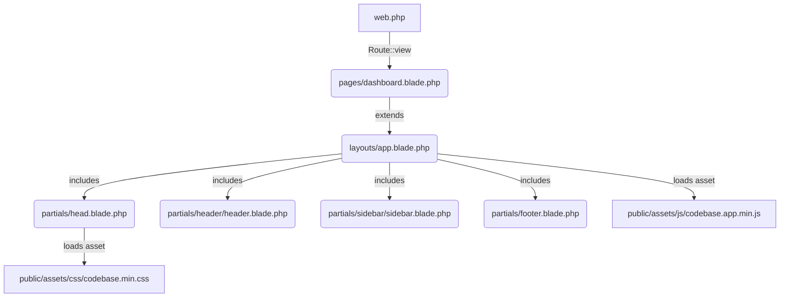

# Walkthrough 02: Architecture & Decision Plan

Dokumen ini menjelaskan rancangan arsitektur perbaikan, keputusan engineering yang diambil, dan justifikasi di balik setiap pilihan teknis untuk membersihkan integrasi Laravel 13 dengan template Bootstrap 5.

---

## 🛠️ Keputusan Arsitektur & Justifikasi Teknis

Berikut adalah detail keputusan arsitektur yang direncanakan dan diterapkan:

### 1. Keputusan: Standar Tunggal CSS Framework (Bootstrap 5)
* **Pilihan:** Menolak penggabungan Tailwind CSS dan berfokus sepenuhnya pada Bootstrap 5.
* **Justifikasi:**
  * Proyek ini menggunakan template premium **Codebase** yang dasarnya adalah Bootstrap 5. Seluruh komponen UI, layouting, grid, dan komponen interaktif bawaan JavaScript template dirancang untuk bekerja serasi dengan Bootstrap.
  * Menghapus Tailwind CSS menghindari pembengkakan ukuran CSS dan menghilangkan risiko konflik *specificity* pada kelas utilitas.
  * Jika kustomisasi style diperlukan di kemudian hari, developer dapat menulis CSS kustom langsung pada berkas [app.css](file:///Users/achmadalfanahsani/Documents/Coding%20Skill/Personal/mulai-aja-website/resources/css/app.css) yang bersih atau memisahkan berkas stylesheet kustom.

### 2. Keputusan: Pembersihan Aset Publik (Static-Only in Public)
* **Pilihan:** Menghapus folder `_js` dan `_scss` mentah dari direktori publik `public/assets/`.
* **Justifikasi:**
  * Mengamankan kode sumber (*source code*) template agar tidak dapat diakses secara langsung oleh pengunjung situs melalui HTTP request.
  * Merampingkan struktur file produksi yang akan di-deploy ke server staging/production.
  * Aset-aset pra-kompilasi yang sudah siap digunakan (diminifikasi dan dioptimasi) tetap berada di folder `public/assets/css` dan `public/assets/js` untuk dimuat menggunakan helper `asset()` bawaan Laravel.

### 3. Keputusan: Cacheable Routing Tanpa Closure
* **Pilihan:** Mengubah rute statis/view dari *closure* menjadi deklarasi `Route::view()` dan `Route::redirect()`.
* **Justifikasi:**
  * Menjamin 100% kompatibilitas dengan fitur optimasi **Route Caching** Laravel (`php artisan route:cache`).
  * Menyederhanakan penulisan file `routes/web.php` sehingga lebih ekspresif dan mudah dibaca oleh tim pengembang lain.
  * Menghindari alokasi memori runtime untuk fungsi anonim pada pemanggilan rute statis sederhana.

### 4. Keputusan: Pemipihan Struktur Partials (Footer Flattening)
* **Pilihan:** Memindahkan berkas `footer.blade.php` keluar dari sub-folder `footer/` langsung ke root folder `partials/`.
* **Justifikasi:**
  * Menghilangkan kompleksitas struktur folder yang tidak perlu (*over-engineering*). Folder partials hanya didekasikan sub-folder khusus jika memiliki banyak sub-komponen (seperti `header` atau `sidebar`).
  * Membuat pemanggilan Blade menjadi lebih pendek, lebih konsisten dengan pemanggilan berkas partials tunggal lainnya seperti `@include('partials.head')`.

---

## 📈 Desain Layout & Alur Data Aset Baru

Aset-aset premium (Codebase CSS & JS) dan data konfigurasi error dihubungkan dengan skema modular berikut:

